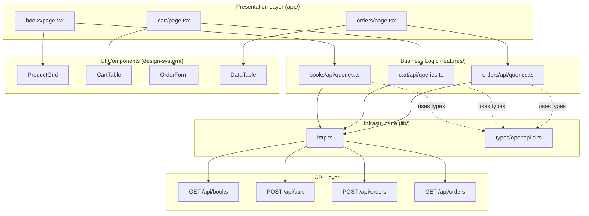

# Design Document

## Overview

This design implements a **simple, no-authentication online bookstore** following the Specification-Driven Development (SDD) approach. The system consists of three main feature modules:

1. **Books Feature**: Browse paginated book catalog with cover images and details
2. **Cart Feature**: Single-item cart management with quantity updates
3. **Orders Feature**: Order placement form and order history viewing

The architecture follows Next.js 14 App Router patterns with TanStack Query for server state management, OpenAPI-generated TypeScript types for API contracts, and YAML-driven UI specifications for page generation. All features are built without authentication requirements to maximize conversion and minimize friction.

**Key Design Principles**:
- Feature-based modular architecture (books, cart, orders)
- Contract-first development with OpenAPI specs
- Type-safe API communication with generated types
- Minimal HTTP client extended to support POST for order creation
- MSW mocks aligned to OpenAPI for development/testing
- Responsive, mobile-first UI with Tailwind CSS

## Steering Document Alignment

### Technical Standards (tech.md)

This design adheres to the technical standards documented in `tech.md`:

- **Next.js 14 with App Router**: All pages use file-based routing in `apps/web/app/`
- **TypeScript Strict Mode**: All components and utilities typed with no `any` types
- **TanStack Query**: Server state management for books, cart, and orders with query key factories
- **Zod Validation**: Runtime validation for API responses and form inputs
- **Tailwind CSS**: Utility-first styling for all UI components
- **Specification-Driven**: OpenAPI specs define APIs, YAML specs define UI pages
- **Code Generation**: Use `pnpm gen:types` for API types, `pnpm gen:page` for page skeletons
- **MSW for Mocking**: API handlers mirror OpenAPI contract for books, cart, and orders
- **Testing**: Vitest for unit/component tests, Playwright for E2E checkout flow
- **Performance**: Next.js Image optimization for book covers, pagination for scalability

### Project Structure (structure.md)

This implementation follows the project organization conventions:

```
apps/web/
  app/
    page.tsx                    # Homepage redirects to /books
    books/
      page.tsx                  # Book catalog (generated from YAML spec)
    cart/
      page.tsx                  # Cart + Order form (generated from YAML spec)
    orders/
      page.tsx                  # Order list (generated from YAML spec)
      [orderNumber]/
        page.tsx                # Order details page
    layout.tsx                  # Root layout with BookStore header

  features/
    books/
      spec/
        page.book-list.yml      # UI spec for book catalog
      api/
        queries.ts              # TanStack Query hooks for books
    cart/
      spec/
        page.cart.yml           # UI spec for cart + order form
      api/
        queries.ts              # Cart queries and mutations
    orders/
      spec/
        page.order-list.yml     # UI spec for order list
        page.order-detail.yml   # UI spec for order details
      api/
        queries.ts              # Order queries and mutations

  design-system/
    data-table.tsx              # Reused for order list
    product-grid.tsx            # NEW: Book catalog grid component
    cart-table.tsx              # NEW: Cart display component
    order-form.tsx              # NEW: Order submission form

  lib/
    http.ts                     # Extended to support POST method
    types/
      openapi.d.ts              # Generated from OpenAPI spec

  mocks/
    handlers.ts                 # MSW handlers for books, cart, orders APIs

docs/specs/api/
  openapi.yaml                  # Extended with books, cart, orders endpoints
```

**Naming Conventions**:
- Components: `PascalCase.tsx` (e.g., `ProductGrid.tsx`, `OrderForm.tsx`)
- API files: `queries.ts`, `mutations.ts` (camelCase)
- Pages: `page.tsx` (Next.js convention)
- YAML specs: `page.{feature-name}.yml` (e.g., `page.book-list.yml`)
- Query keys: Factory pattern with lowercase (e.g., `qk.books()`)

## Code Reuse Analysis

### Existing Components to Leverage

- **DataTable** (`design-system/data-table.tsx`): Reuse for Orders list table
  - Already supports columns, rows, loading state
  - Will use for displaying Order ID and Status columns

- **HTTP Client** (`lib/http.ts`): Extend to support POST requests
  - Current implementation only has GET method
  - Add POST method for order submission: `client.POST(path, { body: data })`
  - Maintain same error handling pattern (throw on non-ok responses)

- **TanStack Query Patterns**: Follow existing query key factory pattern
  - Reuse pattern from customers feature
  - Apply to books, cart, and orders with consistent structure

- **Root Layout** (`app/layout.tsx`): Extend with navigation header
  - Add BookStore branding and Orders link
  - Keep existing providers (QueryClientProvider)

### Integration Points

- **OpenAPI Types** (`lib/types/openapi.d.ts`): Will be regenerated with new endpoints
  - Add `Book`, `BookList`, `Cart`, `CartItem`, `Order`, `OrderForm` types
  - Maintain type safety across all API calls

- **MSW Handlers** (`mocks/handlers.ts`): Add new API mocks
  - `GET /api/books` - Returns paginated book list
  - `POST /api/cart` - Adds book to cart (creates/updates cart)
  - `POST /api/cart/update` - Updates cart item quantity
  - `GET /api/cart` - Retrieves current cart
  - `POST /api/orders` - Creates new order
  - `GET /api/orders` - Lists all orders
  - `GET /api/orders/{orderNumber}` - Order details

- **Tailwind Configuration**: Use existing Tailwind setup
  - No new configuration needed
  - Use utility classes for responsive grid, forms, tables

### New Components Required

- **ProductGrid**: Display books in 5-column responsive grid
- **ProductCard**: Individual book card with image, title, author, price, Buy button
- **CartTable**: Display cart items with quantity input and totals
- **OrderForm**: Form with customer name, email, phone, delivery address
- **OrderList**: Wrapper around DataTable for orders
- **Pagination**: Controls for First/Previous/Next/Last navigation

## Architecture

The bookstore follows a **feature-based modular architecture** with strict separation of concerns:

1. **Presentation Layer** (`app/`): Next.js pages that consume feature APIs
2. **Business Logic Layer** (`features/`): Domain-specific logic, data fetching, mutations
3. **UI Component Layer** (`design-system/`): Reusable, feature-agnostic components
4. **Infrastructure Layer** (`lib/`): HTTP client, types, utilities

**Data Flow**:
```
User Interaction → Page Component → TanStack Query Hook → HTTP Client → API
                                    ↓
                            Cache (TanStack Query)
                                    ↓
                            UI Update (React)
```

### Modular Design Principles

- **Single File Responsibility**: Each component file has one primary export
  - `ProductCard.tsx` - Displays single book
  - `ProductGrid.tsx` - Arranges multiple ProductCards
  - `OrderForm.tsx` - Handles order submission form

- **Component Isolation**: Small, focused components
  - `ProductCard` doesn't know about cart logic
  - `CartTable` doesn't handle order submission
  - `OrderForm` isolated from cart display

- **Service Layer Separation**:
  - Data access: TanStack Query hooks in `features/*/api/`
  - Business logic: Form validation, cart calculations in feature layer
  - Presentation: Page components in `app/`

- **Utility Modularity**: Focused, single-purpose modules
  - HTTP client: Minimal fetch wrapper (GET, POST only)
  - Query key factories: Per-feature factories (books, cart, orders)

### Architecture Diagram



## Components and Interfaces

### Component 1: ProductGrid
- **Purpose:** Display paginated grid of books with 5 books per row, responsive layout
- **Location:** `apps/web/design-system/product-grid.tsx`
- **Interfaces:**
  ```typescript
  interface ProductGridProps {
    books: Book[]
    loading?: boolean
  }
  export function ProductGrid({ books, loading }: ProductGridProps): JSX.Element
  ```
- **Dependencies:** ProductCard component, Tailwind CSS grid utilities
- **Reuses:** Follows design-system patterns, similar structure to DataTable

### Component 2: ProductCard
- **Purpose:** Display single book with cover image, title, author, price, and Buy button
- **Location:** `apps/web/design-system/product-card.tsx`
- **Interfaces:**
  ```typescript
  interface ProductCardProps {
    book: Book
    onBuy: (bookCode: string) => void
  }
  export function ProductCard({ book, onBuy }: ProductCardProps): JSX.Element
  ```
- **Dependencies:** Next.js Image component, form handling
- **Reuses:** Next.js Image optimization pattern, Tailwind card styling

### Component 3: Pagination
- **Purpose:** Provide First/Previous/Next/Last navigation controls
- **Location:** `apps/web/design-system/pagination.tsx`
- **Interfaces:**
  ```typescript
  interface PaginationProps {
    currentPage: number
    totalPages: number
    onPageChange: (page: number) => void
  }
  export function Pagination({ currentPage, totalPages, onPageChange }: PaginationProps): JSX.Element
  ```
- **Dependencies:** None (pure component)
- **Reuses:** Tailwind button styles

### Component 4: CartTable
- **Purpose:** Display cart items with product name, price, quantity input, subtotal, and total
- **Location:** `apps/web/design-system/cart-table.tsx`
- **Interfaces:**
  ```typescript
  interface CartTableProps {
    cart: Cart | null
    onQuantityChange: (code: string, quantity: number) => void
    loading?: boolean
  }
  export function CartTable({ cart, onQuantityChange, loading }: CartTableProps): JSX.Element
  ```
- **Dependencies:** HTML table, form inputs
- **Reuses:** DataTable styling patterns, Tailwind table classes

### Component 5: OrderForm
- **Purpose:** Collect customer information (name, email, phone, address) and submit order
- **Location:** `apps/web/design-system/order-form.tsx`
- **Interfaces:**
  ```typescript
  interface OrderFormProps {
    onSubmit: (formData: OrderFormData) => Promise<void>
    loading?: boolean
  }
  export function OrderForm({ onSubmit, loading }: OrderFormProps): JSX.Element
  ```
- **Dependencies:** React Hook Form (optional) or native form handling, Zod validation
- **Reuses:** Tailwind form styles, validation patterns

### Component 6: OrderList (Page Component)
- **Purpose:** Display list of all orders with Order ID (clickable) and Status
- **Location:** `apps/web/app/orders/page.tsx`
- **Interfaces:** Next.js page component (no props)
- **Dependencies:** DataTable from design-system, useOrders hook
- **Reuses:** Existing DataTable component, follows customer list page pattern

### Component 7: Site Header (Layout Enhancement)
- **Purpose:** Display BookStore branding and Orders navigation link
- **Location:** `apps/web/app/layout.tsx` (enhanced)
- **Interfaces:**
  ```typescript
  function SiteHeader(): JSX.Element
  ```
- **Dependencies:** Next.js Link component
- **Reuses:** Existing layout structure, add header before {children}

## Data Models

### Book Model
```typescript
interface Book {
  code: string              // Unique book identifier (e.g., "book-001")
  name: string              // Full book title
  author: string            // Author name
  price: number             // Price in USD (e.g., 19.20)
  imageUrl: string          // URL to book cover image
}

interface BookListResponse {
  data: Book[]              // Array of books for current page
  pagination: {
    page: number            // Current page (1-indexed)
    pageSize: number        // Items per page (10-20)
    totalPages: number      // Total number of pages
    totalItems: number      // Total books in catalog
  }
}
```

### Cart Model
```typescript
interface CartItem {
  code: string              // Book code
  name: string              // Book name
  price: number             // Unit price
  quantity: number          // Quantity in cart (min: 1)
}

interface Cart {
  item: CartItem | null     // Single item (simplified cart)
  totalAmount: number       // Calculated total (price × quantity)
}

interface AddToCartRequest {
  code: string              // Book code to add
}

interface UpdateCartRequest {
  code: string              // Book code
  quantity: number          // New quantity (min: 1)
}
```

### Order Model
```typescript
interface OrderFormData {
  customer: {
    name: string            // Customer name (required)
    email: string           // Valid email (required)
    phone: string           // Phone number (required)
  }
  deliveryAddress: string   // Full delivery address (required)
}

interface Order {
  orderNumber: string       // Unique order ID (e.g., "ORD-20250110-001")
  status: string            // Order status (e.g., "NEW", "CONFIRMED", "SHIPPED")
  customer: {
    name: string
    email: string
    phone: string
  }
  deliveryAddress: string
  items: CartItem[]         // Ordered items
  totalAmount: number
  createdAt: string         // ISO 8601 timestamp
}

interface OrderListResponse {
  orders: Array<{
    orderNumber: string
    status: string
  }>
}

interface OrderDetailResponse {
  order: Order
}
```

## API Design

### Books API

**GET /api/books**
- **Query Parameters**:
  - `page` (optional): Page number (default: 1)
  - `pageSize` (optional): Items per page (default: 10)
- **Response**: `BookListResponse`
- **Status Codes**: 200 (success), 500 (server error)

### Cart API

**POST /api/cart** (Add to cart)
- **Request Body**: `AddToCartRequest`
- **Response**: `Cart`
- **Status Codes**: 200 (success), 400 (invalid book code), 500 (error)

**GET /api/cart** (Get current cart)
- **Response**: `Cart`
- **Status Codes**: 200 (success), 404 (cart not found)

**POST /api/cart/update** (Update quantity)
- **Request Body**: `UpdateCartRequest`
- **Response**: `Cart`
- **Status Codes**: 200 (success), 400 (invalid quantity), 404 (cart not found)

### Orders API

**POST /api/orders** (Create order)
- **Request Body**: `OrderFormData`
- **Response**: `Order`
- **Status Codes**: 201 (created), 400 (validation error), 500 (error)
- **Validation**:
  - All fields required
  - Email must be valid format
  - Phone must be non-empty string

**GET /api/orders** (List orders)
- **Response**: `OrderListResponse`
- **Status Codes**: 200 (success), 500 (error)

**GET /api/orders/{orderNumber}** (Order details)
- **Response**: `OrderDetailResponse`
- **Status Codes**: 200 (success), 404 (not found), 500 (error)

## State Management

### TanStack Query Key Factories

```typescript
// features/books/api/queries.ts
export const bookKeys = {
  all: () => ['books'] as const,
  lists: () => [...bookKeys.all(), 'list'] as const,
  list: (page: number, pageSize: number) => [...bookKeys.lists(), { page, pageSize }] as const,
}

// features/cart/api/queries.ts
export const cartKeys = {
  all: () => ['cart'] as const,
  current: () => [...cartKeys.all(), 'current'] as const,
}

// features/orders/api/queries.ts
export const orderKeys = {
  all: () => ['orders'] as const,
  lists: () => [...orderKeys.all(), 'list'] as const,
  list: () => [...orderKeys.lists()] as const,
  details: () => [...orderKeys.all(), 'detail'] as const,
  detail: (orderNumber: string) => [...orderKeys.details(), orderNumber] as const,
}
```

### Query Hooks

```typescript
// features/books/api/queries.ts
export function useBooks(page = 1, pageSize = 10) {
  return useQuery({
    queryKey: bookKeys.list(page, pageSize),
    queryFn: () => client.GET<BookListResponse>(`/api/books?page=${page}&pageSize=${pageSize}`)
  })
}

// features/cart/api/queries.ts
export function useCart() {
  return useQuery({
    queryKey: cartKeys.current(),
    queryFn: () => client.GET<Cart>('/api/cart')
  })
}

export function useAddToCart() {
  const queryClient = useQueryClient()
  return useMutation({
    mutationFn: (code: string) => client.POST<Cart>('/api/cart', { body: { code } }),
    onSuccess: () => {
      queryClient.invalidateQueries({ queryKey: cartKeys.all() })
    }
  })
}

export function useUpdateCart() {
  const queryClient = useQueryClient()
  return useMutation({
    mutationFn: ({ code, quantity }: UpdateCartRequest) =>
      client.POST<Cart>('/api/cart/update', { body: { code, quantity } }),
    onSuccess: () => {
      queryClient.invalidateQueries({ queryKey: cartKeys.current() })
    }
  })
}

// features/orders/api/queries.ts
export function useOrders() {
  return useQuery({
    queryKey: orderKeys.list(),
    queryFn: () => client.GET<OrderListResponse>('/api/orders')
  })
}

export function useOrder(orderNumber: string) {
  return useQuery({
    queryKey: orderKeys.detail(orderNumber),
    queryFn: () => client.GET<OrderDetailResponse>(`/api/orders/${orderNumber}`)
  })
}

export function useCreateOrder() {
  const queryClient = useQueryClient()
  const router = useRouter()
  return useMutation({
    mutationFn: (formData: OrderFormData) =>
      client.POST<Order>('/api/orders', { body: formData }),
    onSuccess: () => {
      queryClient.invalidateQueries({ queryKey: orderKeys.all() })
      queryClient.invalidateQueries({ queryKey: cartKeys.all() })
      router.push('/orders')
    }
  })
}
```

## HTTP Client Extension

Extend `lib/http.ts` to support POST method:

```typescript
// lib/http.ts (enhanced)
interface RequestOptions {
  body?: unknown
  headers?: Record<string, string>
}

export const client = {
  GET: async <T>(path: string): Promise<T> => {
    const response = await fetch(path)
    if (!response.ok) {
      throw new Error(`HTTP error! status: ${response.status}`)
    }
    return response.json()
  },

  POST: async <T>(path: string, options?: RequestOptions): Promise<T> => {
    const response = await fetch(path, {
      method: 'POST',
      headers: {
        'Content-Type': 'application/json',
        ...options?.headers,
      },
      body: options?.body ? JSON.stringify(options.body) : undefined,
    })
    if (!response.ok) {
      throw new Error(`HTTP error! status: ${response.status}`)
    }
    return response.json()
  },
}
```

## Error Handling

### Error Scenarios

1. **API Request Failure (Network/Server Error)**
   - **Handling:** TanStack Query catches errors, sets `error` state
   - **User Impact:** Display error alert: "Failed to load [books/cart/orders]. Please try again."
   - **Retry:** TanStack Query auto-retries 3 times with exponential backoff

2. **Cart Not Found (Empty Cart)**
   - **Handling:** Check if `cart.item === null`
   - **User Impact:** Show message: "Your cart is empty. Continue shopping" with link to /books
   - **Retry:** None (expected state)

3. **Order Form Validation Error**
   - **Handling:** Validate form fields before submission (required, email format)
   - **User Impact:** Show inline error messages below invalid fields with red borders
   - **Retry:** User corrects input and resubmits

4. **Order Submission Failure**
   - **Handling:** Mutation catches error, displays error alert
   - **User Impact:** Show error message at top of form: "Failed to place order. Please try again."
   - **Retry:** User can retry submission (mutation not automatically retried)

5. **Book Not Found (Invalid Book Code)**
   - **Handling:** API returns 400/404, mutation catches error
   - **User Impact:** Show error: "Book not available"
   - **Retry:** User returns to catalog

6. **Page Not Found (Invalid Order Number)**
   - **Handling:** useOrder hook returns 404 error
   - **User Impact:** Show 404 page: "Order not found"
   - **Retry:** User returns to orders list

### Error UI Components

- **Error Alert**: Top of page, red background, dismissible
- **Inline Field Error**: Below form input, red text, red border on input
- **Empty State**: Centered message with link back to relevant page
- **Loading State**: Spinner or skeleton UI during data fetching

## Form Validation

### Order Form Validation Rules

```typescript
import { z } from 'zod'

const orderFormSchema = z.object({
  customer: z.object({
    name: z.string().min(1, 'Customer name is required'),
    email: z.string().email('Invalid email address'),
    phone: z.string().min(1, 'Phone number is required'),
  }),
  deliveryAddress: z.string().min(1, 'Delivery address is required'),
})

type OrderFormData = z.infer<typeof orderFormSchema>
```

### Validation Timing
- **On Submit**: Validate all fields when user clicks "Place Order"
- **On Blur**: Optional - validate individual fields when user leaves input
- **Real-time**: Email field validates format as user types (HTML5 validation)

## Testing Strategy

### Unit Testing

**Files to Test**:
- `features/books/api/queries.ts` - Query key factories
- `features/cart/api/queries.ts` - Mutations (addToCart, updateCart)
- `features/orders/api/queries.ts` - Create order mutation
- `lib/http.ts` - GET and POST methods
- Form validation logic

**Test Cases**:
- Query keys generate correct arrays
- HTTP client throws on non-ok responses
- Mutations invalidate correct query keys
- Form validation catches invalid inputs (empty fields, invalid email)

**Tools**: Vitest, @testing-library/react

### Integration Testing

**Component Tests**:
- `ProductCard` - Renders book details, calls onBuy when clicked
- `CartTable` - Displays cart items, calls onQuantityChange
- `OrderForm` - Validates inputs, calls onSubmit with form data
- `Pagination` - Navigates pages correctly

**Test Cases**:
- ProductCard displays book title, author, price, image
- CartTable calculates subtotal and total correctly
- OrderForm shows validation errors for invalid inputs
- Pagination disables First/Previous on page 1, Next/Last on last page

**Tools**: Vitest, @testing-library/react, @testing-library/user-event

### End-to-End Testing

**Critical User Flows**:

1. **Complete Purchase Flow** (E2E priority)
   - Visit homepage → Browse books
   - Click "Buy" on a book → Redirected to cart
   - Review cart → Update quantity
   - Fill order form → Submit
   - Verify redirect to orders page
   - Verify order appears in list

2. **Cart Update Flow**
   - Add book to cart
   - Change quantity
   - Verify subtotal and total recalculate
   - Place order with updated quantity

3. **Order History Flow**
   - Place order
   - Navigate to Orders page
   - Click order number
   - Verify order details displayed

**Test Cases**:
- `checkout.spec.ts` - Complete purchase from browse to order confirmation
- `cart.spec.ts` - Add to cart, update quantity, verify calculations
- `orders.spec.ts` - View order list, view order details

**Tools**: Playwright, running against MSW-mocked APIs

### MSW Mock Handlers

All tests run against MSW handlers that mirror OpenAPI contract:

```typescript
// apps/web/mocks/handlers.ts
import { http, HttpResponse } from 'msw'

export const handlers = [
  // Books API
  http.get('/api/books', ({ request }) => {
    const url = new URL(request.url)
    const page = parseInt(url.searchParams.get('page') || '1')
    const pageSize = parseInt(url.searchParams.get('pageSize') || '10')

    return HttpResponse.json({
      data: mockBooks.slice((page - 1) * pageSize, page * pageSize),
      pagination: {
        page,
        pageSize,
        totalPages: Math.ceil(mockBooks.length / pageSize),
        totalItems: mockBooks.length,
      }
    })
  }),

  // Cart API
  http.post('/api/cart', async ({ request }) => {
    const { code } = await request.json()
    // Mock cart creation logic
    return HttpResponse.json(mockCart)
  }),

  http.get('/api/cart', () => {
    return HttpResponse.json(mockCart)
  }),

  http.post('/api/cart/update', async ({ request }) => {
    const { code, quantity } = await request.json()
    // Mock cart update logic
    return HttpResponse.json({ ...mockCart, item: { ...mockCart.item, quantity } })
  }),

  // Orders API
  http.post('/api/orders', async ({ request }) => {
    const formData = await request.json()
    // Mock order creation logic
    return HttpResponse.json({
      orderNumber: `ORD-${Date.now()}`,
      status: 'NEW',
      ...formData,
      items: [mockCart.item],
      totalAmount: mockCart.totalAmount,
      createdAt: new Date().toISOString(),
    }, { status: 201 })
  }),

  http.get('/api/orders', () => {
    return HttpResponse.json({
      orders: mockOrders
    })
  }),

  http.get('/api/orders/:orderNumber', ({ params }) => {
    const order = mockOrders.find(o => o.orderNumber === params.orderNumber)
    if (!order) {
      return HttpResponse.json({ error: 'Order not found' }, { status: 404 })
    }
    return HttpResponse.json({ order })
  }),
]
```

## Performance Considerations

### Image Optimization
- Use Next.js `<Image>` component for all book covers
- Enable lazy loading: `loading="lazy"`
- Optimize image sizes: 200x300px for cards, responsive sizes
- Use WebP format with JPEG fallback

### Pagination Strategy
- Server-side pagination for book catalog (10-20 items per page)
- Reduce initial data transfer
- Implement cursor-based pagination if catalog grows large (future)

### Code Splitting
- Each page is automatically code-split by Next.js App Router
- Lazy load heavy components (e.g., OrderForm) if needed

### Caching Strategy
- TanStack Query caches book list for 5 minutes (`staleTime: 5 * 60 * 1000`)
- Cart cached for 1 minute (`staleTime: 60 * 1000`)
- Orders cached for 2 minutes
- Background refetch on window focus for cart and orders

### Bundle Size Optimization
- Use tree-shaking for unused code
- Avoid large dependencies (use minimal libraries)
- Monitor bundle size with Next.js build output

## Accessibility Implementation

### Semantic HTML
- Use `<header>`, `<nav>`, `<main>`, `<form>` tags
- Book list: Use `<article>` or `<section>` for cards
- Orders table: Use proper `<table>`, `<thead>`, `<tbody>` structure

### ARIA Labels
```typescript
<button
  onClick={() => onBuy(book.code)}
  aria-label={`Buy ${book.name}`}
  className="btn btn-primary"
>
  Buy
</button>

<input
  type="email"
  id="customerEmail"
  name="customer.email"
  required
  aria-required="true"
  aria-invalid={!!errors.email}
  aria-describedby={errors.email ? "customerEmailError" : undefined}
/>
{errors.email && (
  <div id="customerEmailError" className="text-red-600">
    {errors.email}
  </div>
)}
```

### Keyboard Navigation
- All buttons and links keyboard accessible (tab order)
- Focus visible on all interactive elements (`:focus-visible` styles)
- Form inputs navigable with Tab/Shift+Tab
- Submit form with Enter key

### Screen Reader Support
- Form labels associated with inputs (`<label htmlFor="...">`)
- Error messages announced by screen readers (`aria-live="polite"` on error alerts)
- Loading states announced: "Loading books..." with `aria-live="polite"`

### Color Contrast
- Text contrast ratio ≥4.5:1 for normal text
- Buttons and interactive elements ≥3:1 contrast
- Error messages use color + text (not color alone)

## Security Considerations

### Input Validation
- Validate all form inputs with Zod schema
- Sanitize HTML in book titles/authors (React auto-escapes)
- Email format validation (HTML5 + Zod)
- Phone and address: non-empty string validation

### XSS Protection
- React JSX auto-escapes all content
- Never use `dangerouslySetInnerHTML` unless absolutely necessary
- Content Security Policy (CSP) headers in Next.js config

### CSRF Protection
- Implement CSRF tokens for POST /api/orders endpoint (future)
- Use SameSite cookie attribute for session management (if added)

### HTTPS Enforcement
- Enforce HTTPS in production deployment
- Redirect HTTP to HTTPS in Vercel/hosting config

### No Sensitive Data Logging
- Never log customer email, phone, or address in client-side console
- Remove console.log statements in production build

## Deployment Considerations

### Environment Variables
```
NEXT_PUBLIC_API_BASE_URL=https://api.bookstore.com
```

### Build Process
1. `pnpm gen:types` - Generate TypeScript types from OpenAPI
2. `pnpm typecheck` - Validate TypeScript
3. `pnpm lint` - Run ESLint
4. `pnpm test` - Run unit tests
5. `pnpm build` - Build Next.js production bundle
6. `pnpm test:e2e` - Run E2E tests against production build

### Production Checklist
- [ ] OpenAPI spec complete with all endpoints
- [ ] TypeScript types generated and no errors
- [ ] All YAML UI specs created
- [ ] MSW handlers aligned to OpenAPI
- [ ] Unit tests passing (>80% coverage)
- [ ] E2E checkout flow test passing
- [ ] Lighthouse score: Performance >90, Accessibility 100
- [ ] Error handling for all failure scenarios
- [ ] Loading states on all async operations
- [ ] Mobile responsive (320px to 1920px)
- [ ] WCAG 2.1 Level AA compliance verified
