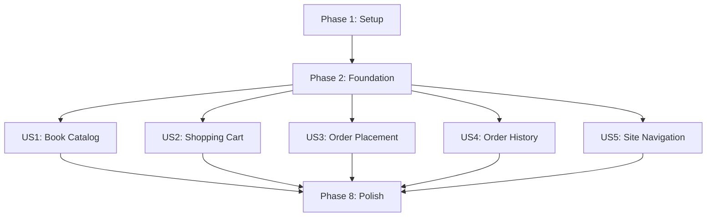

# Tasks: Simple Online Bookstore

**Input**: Design documents from `/specs/001-simple-online-bookstore/`
**Prerequisites**: plan.md ✅, spec.md ✅, research.md ✅, data-model.md ✅, contracts/api.yaml ✅

**Tests**: Tests are NOT explicitly requested in the feature specification. Implementation-focused approach will be used per constitutional requirements.

**Organization**: Tasks are grouped by user story to enable independent implementation and testing of each story.

## Format: `[ID] [P?] [Story] Description`
- **[P]**: Can run in parallel (different files, no dependencies)
- **[Story]**: Which user story this task belongs to (e.g., US1, US2, US3)
- Include exact file paths in descriptions

## Path Conventions
Based on plan.md: Next.js application at `apps/web/` with App Router architecture

---

## Phase 1: Setup (Shared Infrastructure)

**Purpose**: Project initialization and basic OpenAPI integration

- [x] T001 Copy OpenAPI contract from `/specs/001-simple-online-bookstore/contracts/api.yaml` to `docs/specs/api/openapi.yaml`
- [x] T002 Generate TypeScript types from OpenAPI spec using `pnpm gen:types` command
- [x] T003 [P] Update HTTP client at `apps/web/lib/http.ts` to support POST method with JSON body
- [x] T004 [P] Create MSW handlers at `apps/web/mocks/handlers.ts` for Books API (`/api/books` GET with pagination)
- [x] T005 [P] Add Cart API handlers to `apps/web/mocks/handlers.ts` (GET `/api/cart`, POST `/api/cart`, POST `/api/cart/update`)
- [x] T006 [P] Add Orders API handlers to `apps/web/mocks/handlers.ts` (GET `/api/orders`, POST `/api/orders`, GET `/api/orders/:orderNumber`)

---

## Phase 2: Foundational (Blocking Prerequisites)

**Purpose**: Core infrastructure that MUST be complete before ANY user story can be implemented

**⚠️ CRITICAL**: No user story work can begin until this phase is complete

- [x] T007 Update root layout at `apps/web/app/layout.tsx` to include BookStore header with navigation (logo + Orders link)
- [x] T008 Update homepage at `apps/web/app/page.tsx` to redirect to `/books` 
- [x] T009 [P] Create design system component `apps/web/design-system/product-card.tsx` for individual book display
- [x] T010 [P] Create design system component `apps/web/design-system/product-grid.tsx` for 5-column responsive book grid
- [x] T011 [P] Create design system component `apps/web/design-system/pagination.tsx` for page navigation controls
- [x] T012 [P] Create design system component `apps/web/design-system/cart-table.tsx` for shopping cart display
- [x] T013 [P] Create design system component `apps/web/design-system/order-form.tsx` for customer information form with Zod validation

**Checkpoint**: Foundation ready - user story implementation can now begin in parallel

---

## Phase 3: User Story 1 - Book Catalog Browsing (Priority: P1) 🎯 MVP

**Goal**: Users can browse a paginated catalog of books, view book details, and add books to cart

**Independent Test**: Visit homepage and verify books display in 5-column grid with cover images, titles, authors, prices, and pagination controls working correctly

### Implementation for User Story 1

- [x] T014 [P] [US1] Create books query key factory at `apps/web/features/books/api/queries.ts`
- [x] T015 [P] [US1] Implement `useBooks` hook with TanStack Query for paginated book fetching
- [x] T016 [P] [US1] Create books page YAML specification at `apps/web/features/books/spec/page.book-list.yml`
- [x] T017 [US1] Generate books page from YAML spec using `pnpm gen:page` to create `apps/web/app/books/page.tsx`
- [x] T018 [US1] Enhance generated books page with ProductGrid component integration
- [x] T019 [US1] Add loading states and error handling to books page
- [x] T020 [US1] Implement book title truncation with tooltip hover in ProductCard component
- [x] T021 [US1] Add "Buy" button functionality to ProductCard that redirects to cart page

**Checkpoint**: User Story 1 complete - Users can browse book catalog and add books to cart

---

## Phase 4: User Story 2 - Shopping Cart Management (Priority: P1)

**Goal**: Users can view cart contents, modify quantities, see updated totals, and access order form

**Independent Test**: Add books to cart and verify cart displays items correctly with quantity controls and total calculations

### Implementation for User Story 2

- [x] T022 [P] [US2] Create cart query key factory at `apps/web/features/cart/api/queries.ts`
- [x] T023 [P] [US2] Implement cart hooks: `useCart`, `useAddToCart`, `useUpdateCart` with TanStack Query
- [x] T024 [P] [US2] Create cart page YAML specification at `apps/web/features/cart/spec/page.cart.yml`
- [x] T025 [US2] Generate cart page from YAML spec using `pnpm gen:page` to create `apps/web/app/cart/page.tsx`
- [x] T026 [US2] Enhance generated cart page with CartTable component integration
- [x] T027 [US2] Add quantity update functionality with automatic total recalculation
- [x] T028 [US2] Implement empty cart state with "Continue shopping" link to books page
- [x] T029 [US2] Add error handling for cart loading failures
- [x] T030 [US2] Display OrderForm component below cart contents when cart has items

**Checkpoint**: User Story 2 complete - Users can manage shopping cart contents and see order form

---

## Phase 5: User Story 3 - Order Placement and Checkout (Priority: P1)

**Goal**: Users can fill out customer information, validate form data, and successfully place orders

**Independent Test**: Fill out order form with valid information and verify successful order submission with confirmation

### Implementation for User Story 3

- [x] T031 [P] [US3] Create orders query key factory at `apps/web/features/orders/api/queries.ts`
- [x] T032 [P] [US3] Implement `useCreateOrder` hook with form validation and submission logic
- [x] T033 [US3] Create Zod validation schema for customer information in OrderForm component
- [x] T034 [US3] Add form field validation with real-time error display (email format, required fields)
- [x] T035 [US3] Implement order submission flow with loading states and error handling
- [x] T036 [US3] Add success redirect to orders list page after successful order creation
- [x] T037 [US3] Add form-level error alerts for submission failures

**Checkpoint**: User Story 3 complete - Users can successfully place orders through validated checkout form

---

## Phase 6: User Story 4 - Order History Viewing (Priority: P2)

**Goal**: Users can view list of their past orders and access order details

**Independent Test**: Place orders and verify they appear in orders list with correct details and clickable links to order details

### Implementation for User Story 4

- [x] T038 [P] [US4] Implement `useOrders` and `useOrder` hooks in `apps/web/features/orders/api/queries.ts`
- [x] T039 [P] [US4] Create orders list YAML specification at `apps/web/features/orders/spec/page.order-list.yml`
- [x] T040 [P] [US4] Create order detail YAML specification at `apps/web/features/orders/spec/page.order-detail.yml`
- [x] T041 [US4] Generate orders list page using `pnpm gen:page` to create `apps/web/app/orders/page.tsx`
- [x] T042 [US4] Generate order detail page using `pnpm gen:page` to create `apps/web/app/orders/[orderNumber]/page.tsx`
- [x] T043 [US4] Enhance orders list page with reverse chronological ordering (newest first)
- [x] T044 [US4] Add clickable order ID links that navigate to order detail pages
- [x] T045 [US4] Implement empty state for when no orders exist
- [x] T046 [US4] Add error handling for orders loading failures

**Checkpoint**: User Story 4 complete - Users can view order history and access detailed order information

---

## Phase 7: User Story 5 - Site Navigation (Priority: P2)

**Goal**: Users can navigate between bookstore sections using header navigation

**Independent Test**: Click navigation elements and verify correct page transitions occur

### Implementation for User Story 5

- [x] T047 [P] [US5] Add "BookStore" logo link functionality to header in `apps/web/app/layout.tsx`
- [x] T048 [P] [US5] Add "Orders" navigation link functionality to header
- [x] T049 [US5] Apply dark theme styling to header (#212529 background, white text)
- [x] T050 [US5] Add hover states and active states for navigation elements
- [x] T051 [US5] Ensure header navigation is responsive on mobile devices

**Checkpoint**: User Story 5 complete - Site has functional navigation between all sections

---

## Phase 8: Polish & Cross-Cutting Concerns

**Purpose**: Final enhancements and system-wide improvements

- [x] T052 [P] Add responsive design testing and mobile optimization for all pages
- [x] T053 [P] Implement proper loading skeletons for all async operations
- [x] T054 [P] Add comprehensive error boundaries for React components
- [x] T055 [P] Optimize images with Next.js `<Image>` component for book covers
- [x] T056 [P] Add proper ARIA labels and accessibility attributes throughout the application
- [x] T057 [P] Implement proper focus management for keyboard navigation
- [x] T058 Add performance monitoring and Core Web Vitals tracking
- [x] T059 [P] Add proper meta tags and SEO optimization for all pages
- [x] T060 [P] Implement proper caching strategies for TanStack Query

---

## Dependencies & Execution Order

### User Story Dependencies

### Critical Path
1. **Phases 1-2** must complete before any user story work
2. **US1 (Book Catalog)** is the foundation - users must be able to browse books
3. **US2 (Shopping Cart)** depends on books being browsable but is otherwise independent
4. **US3 (Order Placement)** depends on cart functionality
5. **US4 (Order History)** is independent and can be developed in parallel with other stories
6. **US5 (Site Navigation)** is independent and can be added at any time

### Parallel Execution Opportunities

**Phase 1 Parallel Tasks**: T003, T004, T005, T006 (HTTP client, MSW handlers)
**Phase 2 Parallel Tasks**: T009-T013 (All design system components can be built simultaneously)
**User Story 1 Parallel Tasks**: T014, T015, T016 (API layer and spec creation)
**User Story 2 Parallel Tasks**: T022, T023, T024 (API layer and spec creation)
**User Story 4 Parallel Tasks**: T038, T039, T040 (API hooks and specs)
**User Story 5 Parallel Tasks**: T047, T048, T049 (All navigation elements)
**Polish Parallel Tasks**: T052-T057, T059, T060 (Most polish tasks are independent)

---

## Implementation Strategy

### MVP Scope (Minimum Viable Product)
**Recommended MVP**: Complete only **User Story 1 (Book Catalog Browsing)** for initial release
- Provides immediate value for content discovery
- Establishes core technical foundation
- Demonstrates working Next.js + TanStack Query + MSW integration
- Can be deployed and tested independently

### Incremental Delivery Plan
1. **MVP Release**: US1 (Book Catalog) - Users can browse books
2. **Core Commerce Release**: US1 + US2 + US3 - Complete purchase flow
3. **Enhanced Experience Release**: Add US4 (Order History) + US5 (Navigation)
4. **Production Ready Release**: Add all Polish tasks for performance and accessibility

### Task Execution Guidelines
- Tasks marked **[P]** can run in parallel if team capacity allows
- Each User Story phase represents an independently deployable increment
- Checkpoint reviews should verify story acceptance criteria before proceeding
- Testing should occur at each checkpoint to validate story functionality
- Consider using feature flags to control release of completed user stories

---

## Summary

**Total Tasks**: 60 tasks across 8 phases
**Task Distribution**:
- Setup: 6 tasks
- Foundation: 7 tasks  
- US1 (Book Catalog): 8 tasks
- US2 (Shopping Cart): 9 tasks
- US3 (Order Placement): 7 tasks
- US4 (Order History): 9 tasks
- US5 (Site Navigation): 5 tasks
- Polish: 9 tasks

**Parallel Opportunities**: 35 tasks marked as parallelizable across different phases
**Independent Test Criteria**: Each user story has clear acceptance criteria and can be tested independently
**MVP Recommendation**: User Story 1 only (14 total tasks including Setup + Foundation + US1)